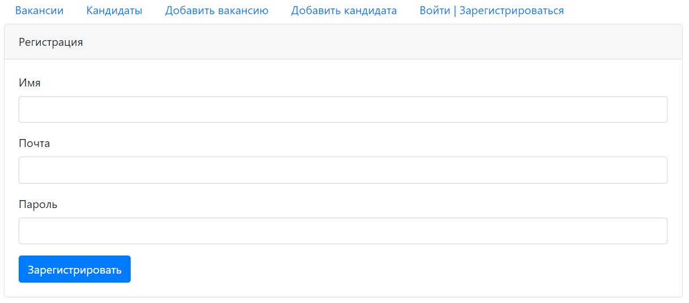
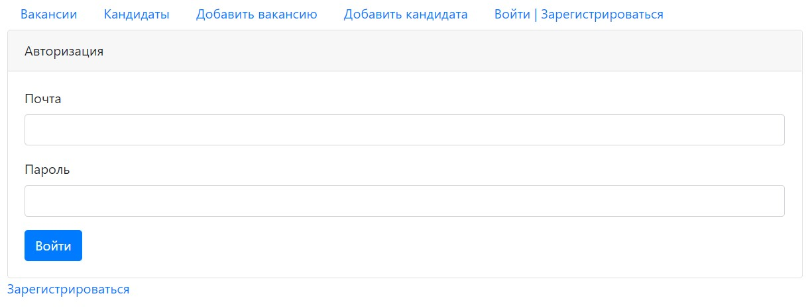
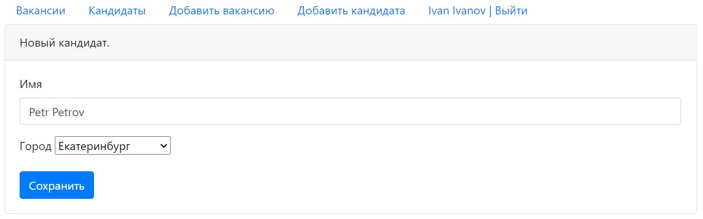
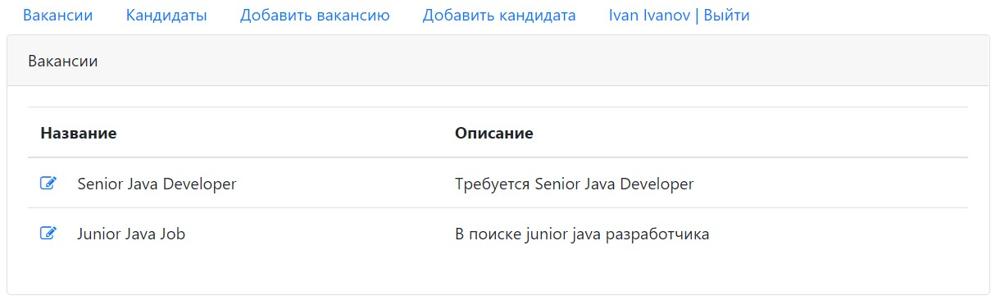

# Dream Job

## О проекте
Площадка для размещения вакансий и кандидатов.

### Функционал
- CRUD операции с PostgreSQL и JDBC для вакансий и кандидатов.
- Авторизация/регистрация. Учётные данные хранятся в БД. Без авторизации
ограничен доступ к некоторым страницам.

### Используемые технологии
- Servlet/JSP
- JDBC/PostgreSQL
- Maven
- Apache Tomcat
- JUnit/Mockito
- Slf4j
- Travis
- JS, AJAX, JSP, HTML (front)
- архитектурный паттерн MVC

### Демо
Страница регистрации

Страница авторизации

Добавление кандидата

Список кандидатов

Список вакансий
